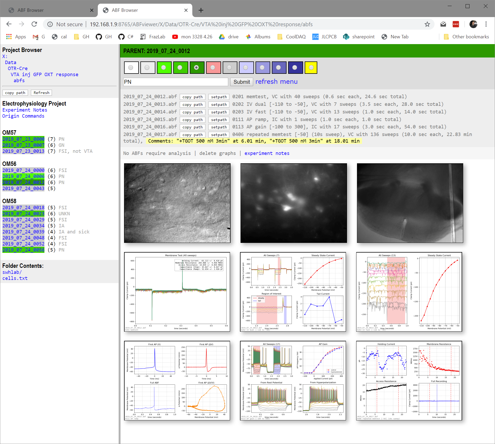

# FlaskABF
**FlaskABF is a Python-based web application designed to browse and analyze electrophysiology data stored as Axon Binary Format (ABF) files.** This project provide a web interface (using the [Flask microframework](http://flask.pocoo.org)) for browsing experiment folders and displays ABF information (using [pyABF](https://github.com/swharden/pyABF)) and micrographs. Folders can be added to the auto-analysis folder list and [pyABFauto](https://github.com/swharden/pyABFauto) automatically creates graphs as new ABF files appear (ideal for use on network drives). Experiment notes and cell notes can also be edited from the web interface.

This project replaces abandonware like [SWHLab](https://github.com/swharden/SWHLab) (for auto-analysis) and [SWHLabPHP](https://github.com/swharden/SWHLabPHP) (for web browser navigation).